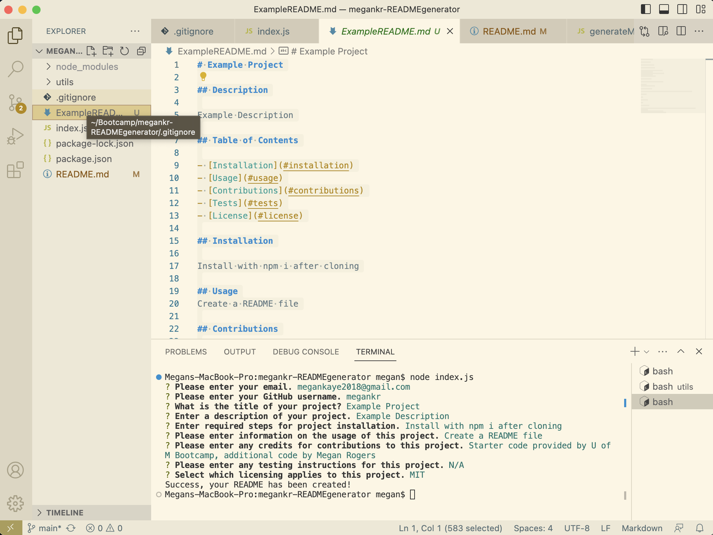

# megankr-READMEgenerator

A repository for the U of M Coding Bootcamp Challenge 09, creating a README file through the command line interface.

## Description

This project called for us to utilize packages, specifically the Inquirer package. Through this we could prompt a user with questions which would then aid in generating a professional README for the user.

## Table of Contents

- [Installation](#installation)
- [Usage](#usage)
- [Contributions](#contributions)
- [Tests](#tests)
- [License](#license)

## Installation

Install by running "npm i" in the terminal after cloning.

## Usage

DISCLAIMER FOR GRADERS: Screencastify would crash each time I attempted to record, this screenshot is temporary while I find a solution. Photo includes the terminal after running node index.js and includes the generated README

## Contributions

Starter code provided by U of M Bootcamp, additional code by Megan Rogers

## Tests

N/A

## License

N/A

## Questions

For any questions regarding this project, feel free to contact me through the following:
- Email: megankaye2018@gmail.com
- GitHub: https://github.com/megankr
